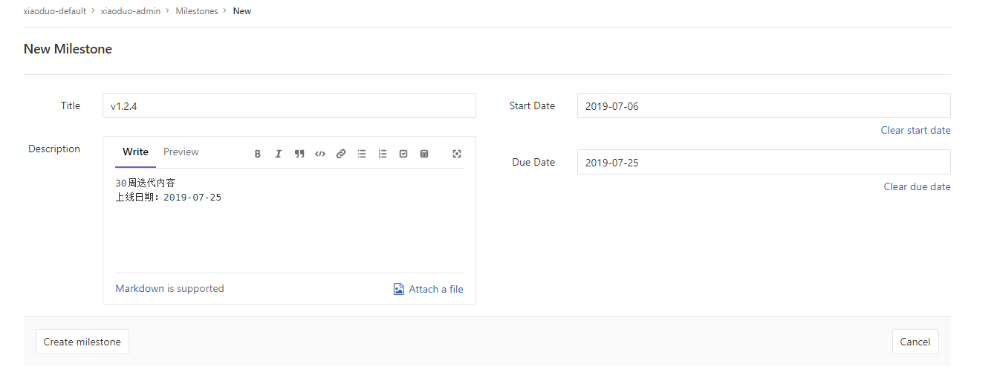
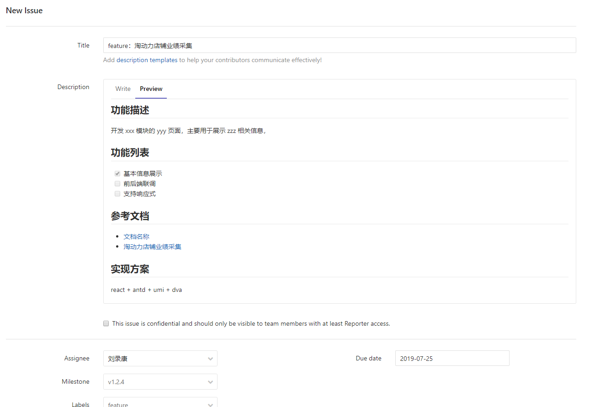
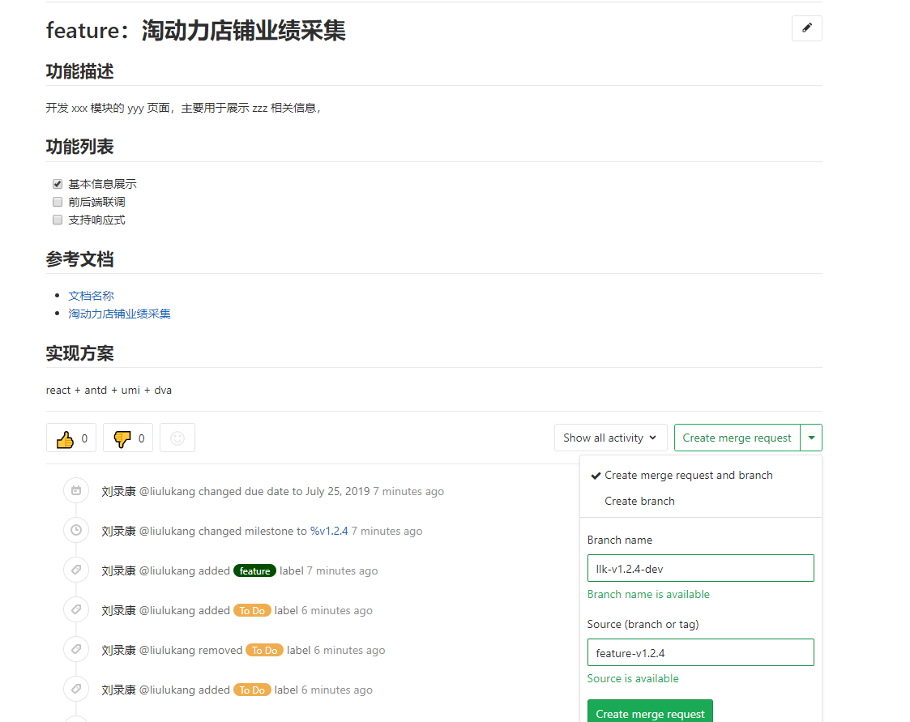
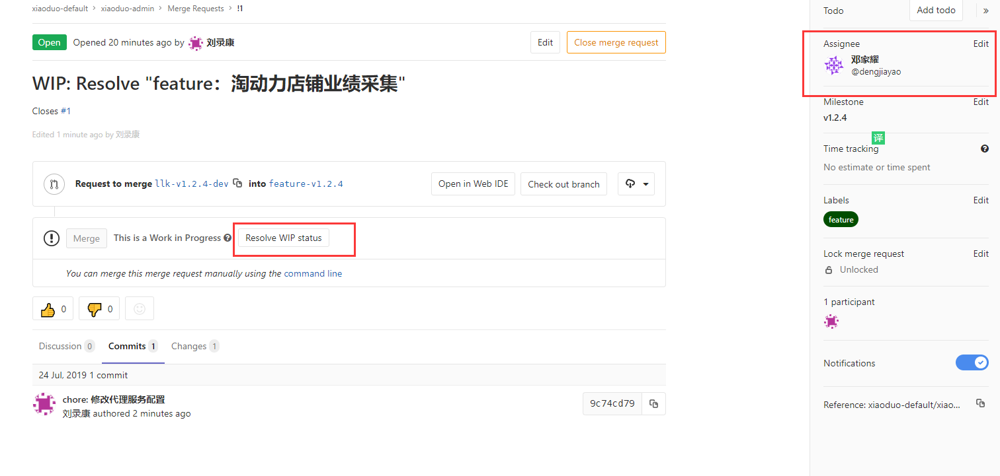
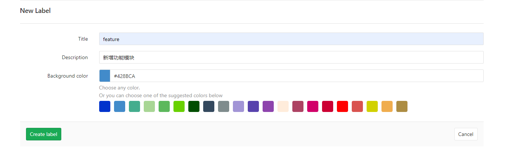
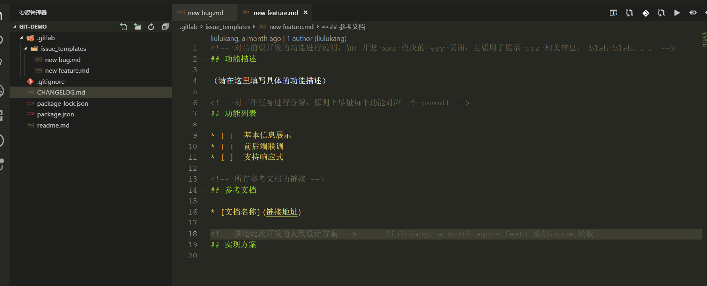
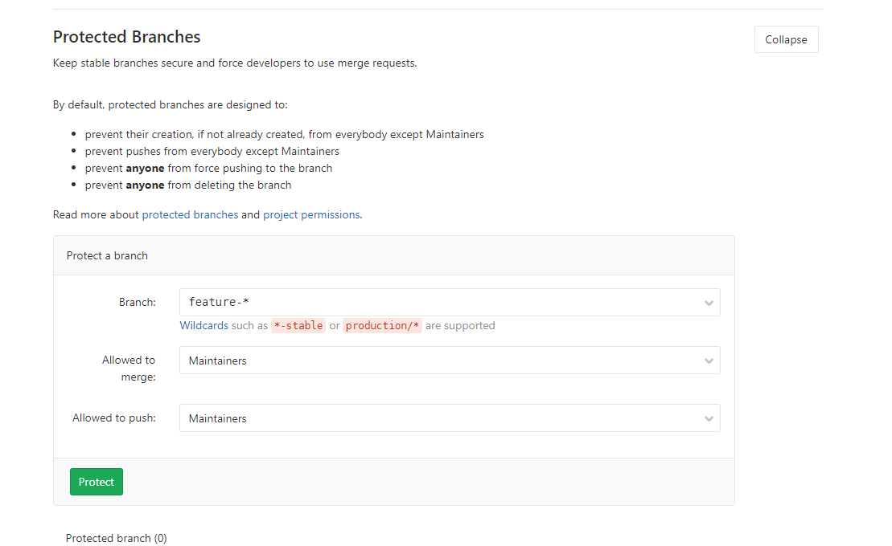
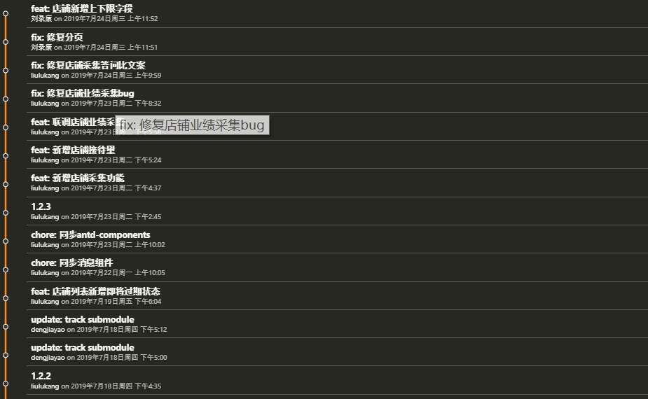

## GitLab Pull Request 工作流

### 完整版流程

#### 1. 创建里程碑 `Milestones`

需求评审完成，确认迭代内容，创建里程碑`v1.2.3`，迭代分支 `master -> release-*`，一个 `release` 分支可能有多个人员参与。



#### 2. 创建事件问题 `Issues`

开发者拆分需求迭代任务，创建 `issues`，**关联里程碑、标签，确认个人开发任务**。



#### 3. 创建 `merge request`

开发者创建 `issue` 后，跳转 `issue` 详情页可创建 `issue` 相关 `merge request`以及个人开发分支



此时的 `merge request` 的状态是 等待解决 `WIP:`

> 创建 个人开发分支时，请注意选择 当前里程碑（迭代）的 release 分支，不是 master 分支 作为主分支

> 脱离 `issue` 也可以创建 `merge request`

#### 4. 功能开发过程

开发者 提交代码，修改`merge request`处理人，状态，管理员进行 `code review` && `merge` 操作



通知管理员 检查代码并合并

**注意事项：**

1. **不应该在 `release` 分支上面直接修改提交代码**
1. 开发过程中时，建议定期地、及时地将 `release` 分支上的改动合并到自己的开发分支，提前解决冲突，避免最后一次性进行大量的解决冲突操作；`release` 分支合并到 `master` 同理

> 公司现有 `gitlab` 似乎不支持，邮件通知

#### 5. 上线 && 收尾

**管理员:** 合并 `release` 分支到 `master` 分支，打 `tags`，关闭 `milestones`

**开发者:** 清理 个人开发分支，关闭 `issue`

#### 6. 其他补充

1. 创建常用标签 `Labels`

管理员需要创建常见的标签，用于区分统计 `issue`、

例如：`feature，bug，chore，styles，docs，hotfix`，使用不同颜色区分



2. `issue` 模板的使用



3. `master release` 分支保护



4. 代码分支问题

管理员 负责 `master release` 分支合并权限，在其他需求或者紧急修复时，应当及时同步到其他迭代分支 (`release`) 分支

开发者 提交 `merge request` 前，需要同步`release` 分支代码，解决相应冲突，确保管理员能直接 `merge`

5. 代码同步方式

推荐使用 `rebase` 方式，不强制，有风险，可能丢失提交纪录

`git rebase` 简单使用示例：

```bash
# 同步 release-1.2.4
git:(llk-dev-v.1.2.4) git rebase origin/release-1.2.4

# 合并重复提交并解决冲突
git rebase --continue

# 因为 rebase 修改了commit 历史，只能强制提交（危险）
git push -f

```



### 快捷简版流程（目的 code review）

1. 从 `master` 创建 `release-*` 迭代分支
2. 从 `release-*` 创建 `feature-*` 个人开发分支
3. 开发完成，直接创建 `merge requests`, 此处无法关联里程碑，issue
4. 合并提交
