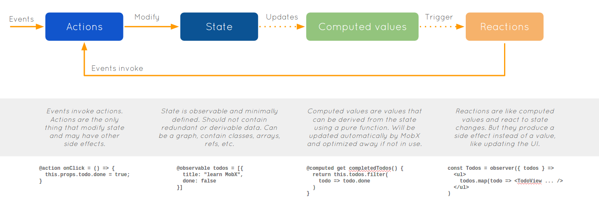

# Mobx

## 前言

目前 React 和 Redux 开发，是前端业内很普遍的一种项目解决方案。本着学习和变换思路的目的，给大家分享一下 React 和 Mobx 这种数据状态管理模式。

> GitHub 上 [Mobx](https://github.com/Mobxjs/Mobx) 拥有 **20.9k**，[Redux](https://github.com/Reduxjs/Redux) 拥有 **51.6k**

Mobx 是一个透明函数响应式编程的状态管理库，它使得状态管理简单可伸缩。学习成本低，上手快，基础知识简单，跟 Vue 一样的核心原理（响应式编程）。写更少的代码，完成更多的事，不用和 Redux 一样写非常多的样板代码。面向对象编程，具有响应式能力(计算属性&监听)

### 数据流转 & 状态更新

<!-- **Mobx** -->



<!-- **Redux** -->

<!--  -->

### 基本使用

```bash
npm install Mobx Mobx-react --save
```

#### store 声明

```javascript
// todoStore.js
import { observable, computed, autorun, when, action } from 'mobx'

class TodoStore {
  // Observable 可观察的状态,类vue data 属性，响应式更新界面
  @observable todos = []
  @observable loading = false
  @observable pendingRequests = 0

  constructor() {
    // Reactions(反应),当内部依赖 report 发生变化时，响应式执行，类vue watch属性
    autorun(() => console.log(this.report))

    // Reactions(反应),当第一个函数依赖发生变化时,执行第一个函数，如果返回true 则执行第二份函数
    when(
      // 如果
      () => {
        console.log(this.pendingRequests)
        return  !this.pendingRequests
      },
      // 然后
      () =>{
        this.loading=false
      }
    );

    // 更新粒度的控制 reaction
  }

  // Computed values(计算值)，类vue computed 属性
  // 与 autorun 相同，内部依赖发生变化，重新执行，如不需要产生新值，请使用 autorun
  @computed get completedTodosCount() {
    return this.todos.filter((todo) => todo.completed === true).length
  }

  // 响应式更新过于自由，可以开启严格模式,只允许使用action 更新数据
  // useStrict(true)
  @action addTodo(task) {
    this.todos.push({
      task: task,
      completed: false,
      assignee: null,
    })
  }
}

export default const todoStore = new TodoStore()
```

#### React 数据注入

```javascript
// main.js
import { Provider, observer } from "mobx-react";

import todoStore from "todoStore";
import todoStore2 from "todoStore2";
import TodoView from "./TodoView";

// 注入 store 里面的模块，类 vuex mapState
@inject("todoStore")
// @inject((store) => ({
//   todoStore: store.todoStore,
// }))
// 将无状态状态函数 组件 变成响应式组件
@observer
class TodoList extends React.Component {
  handleAdd = () => {
    const { todoStore } = this.props;
    todoStore.todos.push({
      task: "new task",
      completed: false,
      assignee: null
    });
  };

  render() {
    const todoStore = this.props;
    return (
      <div>
        <ul>
          {todoStore.todos.map((todo, idx) => (
            <TodoView todo={todo} key={index} />
          ))}
        </ul>
        <button onClick={this.handleAdd}>New Todo</button>
      </div>
    );
  }
}

// Provider是一个组件，将数据存储到React context上下文机制（或其他东西）并传递给子组件。

ReactDOM.render(
  <Provider todoStore={todoStore1} todoStore2={todoStore2}>
    <TodoList />
  </Provider>,
  document.getElementById("#root")
);
```

#### React 数据使用

```javascript
// TodoView.js
import { observer, inject } from "mobx-react";

@observer
class TodoView extends React.Component {
  handleInput = () => {
    const { todo } = this.props;
    // 直接修改
    todo.completed = !todo.completed;
  };

  handleRename = () => {
    const { todo } = this.props;
    todo.task = "new name";
  };

  render() {
    const todo = this.props.todo;
    return (
      <li onDoubleClick={this.handleRename}>
        <input
          type="checkbox"
          checked={todo.completed}
          onChange={this.handleInput}
        />
        {todo.task}
      </li>
    );
  }
}
```

#### Mobx 与 Redux

- store 存储：Redux 是单个 store，Mobx 可以是多个
- 数据结构：Redux 使用正常的 对象，而 Mobx 进行包裹，得到 observable 数据
- 编程方式：Redux 函数式编程，Mobx 面向对象编程
- immutable：Redux 要求数据的不可变形，而 Mobx 则不要求
- action：Redux 通过 action 来驱动数据的变化，是必选项，而 Mobx 则为可选项
- 代码量：Mobx 代码量小，可以快速完成简单业务开发
- 耦合性：Redux 耦合度低，可以便于复用，也方便进行单元测试
- 生态环境：Redux 的生态环境优于 Mobx
- 使用场景：Mobx 适用于简单的业务，快速完成开发；Redux 适用于复杂场景
- 开发体验：Mobx 类 vue 开发，响应式。在不使用 dva 的情况下，redux 开发过于复杂，模板代码较多

### 其他

- 装饰器
