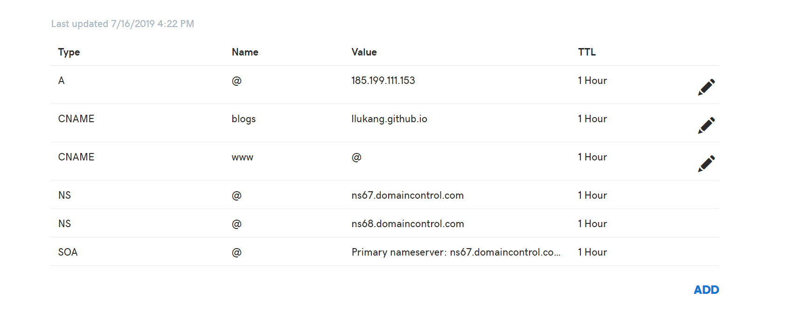

## DNS 解析

DNS （Domain Name System 的缩写）的作用非常简单，就是根据域名查出 IP 地址。

### DNS 配置

DNS服务器的IP地址，有可能是动态的，每次上网时由网关分配，这叫做DHCP机制；也有可能是事先指定的固定地址。Linux系统里面，DNS服务器的IP地址保存在/etc/resolv.conf文件。


### 域名的层级结构

  **示例:**

  ```bash
  #主机名.次级域名.顶级域名.根域名
  www.baidu.com.root
  ```

- 根域名
  .root 对于所有域名都是一样的，所以平时是省略的，最终就变成了我们常见的样子。

- 顶级域名 （top-level domain，缩写为 TLD）

  也叫做一级域名，常见的如 .com / .net / .org / .cn 等等，他们就是顶级域名。

- 二级域名（second-level domain，缩写为 SLD）

  比如 baidu.com。这是我们能够购买和注册的最高级域名。

- 次级域名（主机名）（host）

  也可以称为三级域名，比如 www.baidu.com，由此往下，基本上 N 级域名就是在 N-1 级域名前追加一级。

### 域名解析过程

与域名的分级结构对应，DNS 系统也是一个树状结构，不同级别的域名由不同的域名服务器来解析，整个过程是一个「层级式」的。
层级式域名解析体系的第一层就是根域名服务器，全世界 IPv4 根域名服务器只有 13 台（名字分别为 A 至 M），1 个为主根服务器在美国，其余 12 个均为辅根服务器，它们负责管理世界各国的域名信息。在根服务器下面是顶级域名服务器，即相关国家域名管理机构的数据库，如中国互联网络信息中心（CNNIC）。然后是再下一级的权威域名服务器和 ISP 的缓存服务器。

一个域名必须首先经过根数据库的解析后，才能转到顶级域名服务器进行解析，这一点与生活中问路的情形有几分相似。

### 域名记录的类型

域名服务器之所以能知道域名与 IP 地址的映射信息，是因为我们在域名服务商那里提交了域名记录。购买了一个域名之后，我们需要在域名服务商那里设置域名解析的记录，域名服务商把这些记录推送到权威域名服务器，这样我们的域名才能正式生效。

在设置域名记录的时候，会遇到「A 记录」、「CNAME」 等不同类型，这正是前面做域名解析的时候我们碰到的结果。这些类型是什么意思，它们之间有什么区别呢？接下来我们看看常见的记录类型。
 
- **A 记录**
 
  A (Address) 记录用来直接指定主机名（或域名）对应的 IP 地址。主机名就是域名前缀，常见有如下几种：

  - www：解析后的域名为 www.yourdomain.com，一般用于网站地址。

  - @：直接解析主域名。
  - *：泛解析，指将 *.yourdomain.com 解析到同一 IP。

- **CNAME 记录**

  CNAME 的全称是 Canonical Name，通常称别名记录。如果需要将域名指向另一个域名，再由另一个域名提供 IP 地址，就需要添加 CNAME 记录。

  > A 记录就是把一个域名解析到一个 IP 地址，而 CNAME 记录就是把一个域名解析到另外一个域名，其功能差不多。但是 CNAME 相当于将域名和 IP 地址之间加了一个中间层，可以带来很大的灵活性，特别是当你要使用但是并不拥有那些域名的时候。

- **MX 记录。**

  邮件交换记录，用于将以该域名为结尾的电子邮件指向对应的邮件服务器以进行处理。


- **NS 记录。**

  域名服务器记录，如果需要把子域名交给其他 DNS 服务器解析，就需要添加 NS 记录。


- **AAAA 记录。**

  用来指定主机名（或域名）对应的 IPv6 地址，不常用。


- **TXT 记录。**

  可以填写任何东西，长度限制 255。绝大多数的 TXT 记录是用来做 SPF 记录（反垃圾邮件），MX 记录的作用是给寄信者指明某个域名的邮件服务器有哪些。SPF 的作用跟 MX 相反，它向收信者表明，哪些邮件服务器是经过某个域名认可会发送邮件的。


- **显性 URL。**
  
  从一个地址 301 重定向（也叫「永久性转移」）到另一个地址的时候，就需要添加显性 URL 记录。


- **隐性 URL。** 
  
  从一个地址 302 跳转（也叫「临时跳转」）到另一个地址，需要添加隐性 URL 记录。它类似于显性 URL，区别在于隐性 URL 不会改变地址栏中的域名。

- **其他**

  **TTL** 表示解析记录在 DNS 服务器中的缓存时间，时间长度单位是秒，一般为3600秒。比如：在访问 news.qq.com时，如果在 DNS 服务器的缓存中没有该记录，就会向某个 NS 服务器发出请求，获得该记录后，该记录会在 DNS 服务器上保存 TTL 的时间长度，在 TTL 有效期内访问 news.qq.com，DNS 服务器会直接缓存中返回刚才的记录。


- **示例**



### DNS 智能解析

- **将一个域名解析到多个 IP**

  例如我们一个网站有多台前端机，希望用户访问的时候，可以随机分散到这些机器上，以增加网站承载能力。有一种解决的办法就是对同一个域名设置多条 A 记录，分别指定到不同的 IP 上。

- **根据特征差异将不同请求解析到不同 IP**

  DNS 服务商不光可以区分网络运营商，还可以根据访问者的地理位置来设置不同的解析线路，而且甚至还可以为搜索引擎设置特定的解析地址。


### DNS 污染与安全挑战


### 其他

参考资料： 
- [DNS 原理入门](http://www.ruanyifeng.com/blog/2016/06/dns.html)
- [域名那些事儿](https://juejin.im/post/5d2c414ef265da1bd04f11f3)
